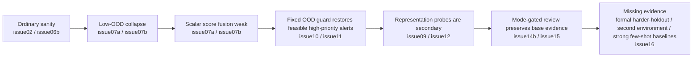
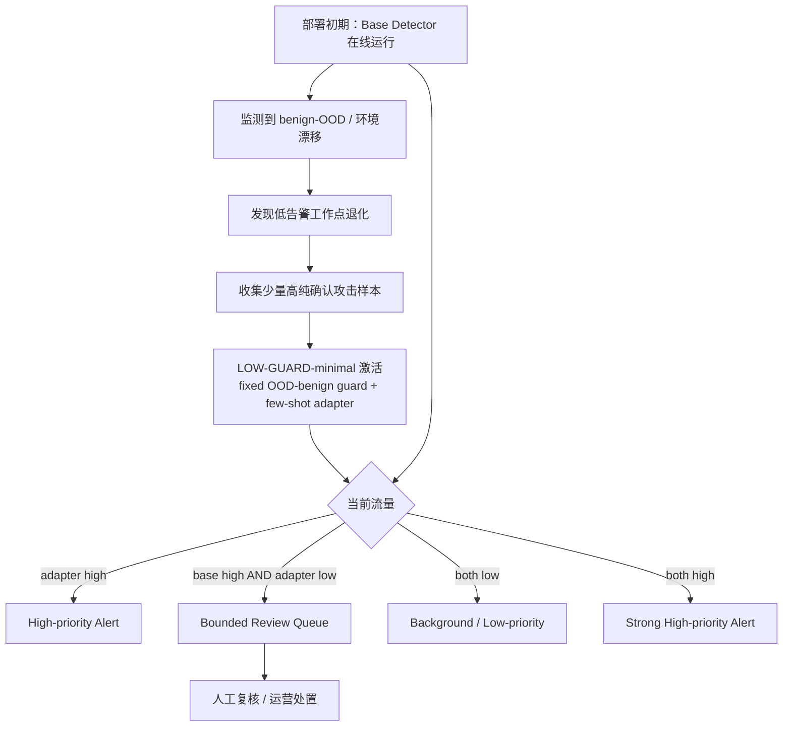
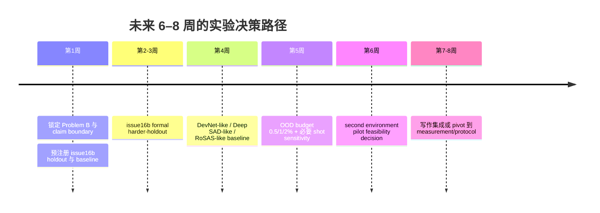

# 面向重构的 IDS 论文前沿定位与实验路线报告

## Executive Summary

这条线**值得继续冲高水平**，但前提是你必须把论文从“few-shot LR 修复 dA/Transformer”**重定义为一个更窄、更硬的问题**：**良性 OOD 漂移下的低告警入侵检测**，以及**部署阶段的 guard-aware 少样本适配**。公开文献已经明确表明，NIDS 在同数据集内可以接近完美，但跨数据集/跨环境时会显著失真；你的仓库证据又已经显示，base-only 在 low-OOD 工作点几乎坍塌，而 fixed-guard 的 minimal adapter 能在当前主 split 上恢复高优先级攻击检出，但 formal harder-holdout / second-environment 还没有完成。所以，这不是“值不值得继续”的问题，而是“该不该立刻按新问题重构论文”的问题。答案是：**该，而且要马上做**。citeturn15academia0turn15academia2turn13academia1turn19academia2 fileciteturn14file0L3-L3 fileciteturn13file0L3-L3 fileciteturn12file0L3-L3 fileciteturn15file0L3-L3

你当前最强、最有论文味的内部信号，不是“GDA-only 很强”，而是**“普通 ranking/closed-set 指标并不能代表低告警部署可靠性”**。仓库里已经出现了一个非常重要的证据：dA 的 base-only 在当前协议下 **ROC-AUC 仍有 0.806**，但最终 OOD budget 下的 **attack detection 只有 0.0029**；这说明你的 paper 真正要打的，不是“谁 AUC 更高”，而是“谁在**告警预算**下仍然能工作”。这类 operating-point reliability 问题，正好和近年 Neyman–Pearson、partial AUC、distribution shift-aware selective classification 的前沿方向对齐。fileciteturn10file0L3-L3 citeturn4academia1turn20academia0turn6academia0

当前仓库还给了你第二个很关键的边界：**仲裁机制可以保留 base evidence，但不能被写成新增主检出贡献**。issue14b 表明 mode-gated arbitration 的 high-priority 指标本质上与 GDA-only 对齐；issue15 表明 review queue 平均规模在 dA 下约为主 seeds 96.2、held-out 108.0，且攻击占比只有 0.0173 和 0.00367。因此，review queue 的正确角色是**bounded safety net**，不是“我们又多检出了很多攻击”。如果你这样写，仲裁是系统贡献；如果你把它写成主方法增益，审稿人会直接打掉。fileciteturn13file0L3-L3 fileciteturn12file0L3-L3

最大机会在于：你现在站在一个**交叉前沿**上，而不是单点方法上。相关研究分别在谈跨数据集泛化、normality shift、unknown attack/open-set、few-shot anomaly detection、selective classification，但**几乎没有工作把它们合成为一个部署问题**：**当 benign-OOD 把低告警工作点污染后，如何利用少量高纯确认攻击样本，在显式约束 OOD 高优先级告警的前提下，做 deployment-stage guarded adaptation，并保留 base detector 的 review safety net**。这就是你最应该守住的“问题驱动立脚点”。citeturn15academia0turn19academia2turn16academia1turn16academia3turn3academia1turn6academia0

最大风险也非常清楚：**如果你现在直接投稿，审稿人极可能把它读成“cost-sensitive LR + 一套规则仲裁”**。原因不是他们不懂，而是你目前还缺两类能防守的证据：第一，**formal harder-holdout / second-environment**，第二，**与 few-shot / semi-supervised anomaly baselines 的同协议对比**。issue16 当前只是 feasibility pack，已经明确写明“项目还没有完成正式 harder-holdout 或 second-environment 泛化验证”。这意味着你今天还不能写“该机制已证明可泛化到更难环境”。fileciteturn15file0L3-L3

**立刻要做的一件事**：锁定下面我给你的 **Problem B**，并以它为唯一主线，马上跑 **issue16b formal harder-holdout fixed-guard validation**；与此同时，补至少一条 **DevNet-like / Deep SAD-like / RoSAS-like** 的 few-shot anomaly baseline。**不要先升级 LR，不要先打磨 review queue，不要先写主稿。** 先把 hardest missing evidence 补上，再决定你是走方法论文，还是 measurement/protocol 论文。fileciteturn15file0L3-L3 citeturn3academia1turn2academia0turn24academia0

| 结论项 | 判断 |
|---|---|
| 是否值得继续 | **值得**，但要按新问题重构，不是按“few-shot LR 修复旧模型”继续 |
| 当前是否够 A 区 / 一区 / 安全顶会风格 | **还不够稳**；如果现在就投，高概率因 generalization 与 novelty framing 被拒 |
| 最大机会 | 把 benign-OOD drift、low-alert budget、deployment-stage few-shot adaptation、bounded review 四条线合成一个问题 |
| 最大风险 | 被审稿人压扁成 cost-sensitive LR + heuristic arbitration |
| 立刻要做 | 以 Problem B 重构论文，并优先做 issue16b formal harder-holdout + few-shot anomaly baselines |

## Frontier Problem Map 2022–2026

近四年的主线并不是“谁在 CICIDS 上再刷 0.2% accuracy”，而是在反复暴露一个事实：**部署环境改变后，普通 benchmark 结果并不可靠**。这条主线在 NIDS 里表现为 cross-dataset generalization，在 anomaly detection 里表现为 distribution shift / normality shift，在决策层表现为 low-FPR / selective classification，在方法层表现为 few-shot / semi-supervised anomaly learning 和 adaptation。你的问题如果重写得当，正好落在这些方向的交叉区。citeturn15academia0turn13academia1turn19academia2turn6academia0turn20academia0

| 方向 | 代表论文 | venue / year | 解决的问题 | 方法与评测协议 | 与你的关系 | 已解决 / 未解决 |
|---|---|---|---|---|---|---|
| 跨数据集泛化 | *On the Cross-Dataset Generalization of Machine Learning for Network Intrusion Detection* citeturn15academia0；*Assessing Generalisation Capability of Machine Learning Models for Intrusion Detection* citeturn15academia2 | arXiv 2024；arXiv 2026 | 证明同数据集高分并不等于跨环境可用 | 训练/测试分离到不同 IDS 数据集；前者报告 same-dataset 近乎完美、cross-dataset 接近随机，后者在 UNSW-NB15 与 TON-IoT 间 cross-dataset 准确率跌到 40% 以下 | **强相关**。这是你问题成立的最硬外部论据 | 已解决：benchmark→deployment gap 的存在；未解决：在**低告警预算**下如何做部署后适配 |
| shift-aware anomaly benchmark | *AnoShift: A Distribution Shift Benchmark for Unsupervised Anomaly Detection* citeturn13academia1；*CAShift: Benchmarking Log-Based Cloud Attack Detection under Normality Shift* citeturn19academia2 | arXiv 2022；arXiv 2025 | 把 anomaly detection 的 shift 问题显式 benchmark 化 | AnoShift 在 Kyoto-2006+ 上设 IID / NEAR / FAR；CAShift 显式设计 application / version / architecture normality shift，并观察到性能最高下降 34% | **非常相关**。它们支撑你“benign-OOD / normality shift 必须单独评估”的 protocol 价值 | 已解决：shift-aware benchmark 必要性；未解决：few-shot attack support + alert-budgeted adaptation |
| 概念漂移缓解 | *METANOIA: A Lifelong Intrusion Detection and Investigation System for Mitigating Concept Drift* citeturn19academia0；*Generative Active Adaptation for Drifting and Imbalanced Network Intrusion Detection* citeturn25academia0 | arXiv 2024；arXiv 2025 | 漂移会推高 IDS 误报，需要持续/主动适配 | METANOIA 做 lifelong provenance IDS；Generative Active Adaptation 用主动标注 + 生成式增强应对 drift 与 rare attack | **相邻前沿**。说明“drift 后 adaptation”不是你首创 | 已解决：drift adaptation 是真实问题；未解决：**良性 OOD 高优先级告警约束**与极简 adapter 的部署语义 |
| open-set / unknown attack IDS | *Detecting Unknown Attacks in IoT Environments: An Open Set Classifier for Enhanced Network Intrusion Detection* citeturn16academia1；*Open Set Dandelion Network for IoT Intrusion Detection* citeturn16academia3 | arXiv 2023；arXiv 2023 | 识别训练中未见过的攻击 | 前者是 open-set classifier + stacking/sub-clustering；后者是 open-set heterogeneous domain adaptation | **相关但不等同**。它们关注未知攻击类别，你关注的是**良性 OOD 污染低告警工作点** | 已解决：unknown attack detection；未解决：benign-OOD false high alerts、deployment-stage few-shot repair |
| few-shot / semi-supervised anomaly detection | *Deep Semi-Supervised Anomaly Detection* citeturn2academia0；*Explainable Deep Few-shot Anomaly Detection with Deviation Networks* citeturn3academia1；*ESAD* citeturn3academia2；*RoSAS* citeturn24academia0 | foundational 2019–2021；arXiv 2023 | 用少量异常标签直接学 anomaly score | Deep SAD / DevNet / ESAD 是经典少样本异常学习，RoSAS 强调污染鲁棒和连续监督 | **高度相关**。它们会直接威胁你的 novelty，如果你不跟它们比 | 已解决：few-shot anomaly learning 合法且有效；未解决：NIDS benign-OOD low-alert 部署协议与 base coexistence |
| 少标注 IDS 与 shift 适配 | *SF-IDS: An Imbalanced Semi-Supervised Learning Framework for Fine-grained Intrusion Detection* citeturn24academia3；*Zero-shot domain adaptation of anomalous samples for semi-supervised anomaly detection* citeturn24academia1 | arXiv 2023；arXiv 2023 | 少标注攻击与 domain shift 并存 | 一个是 intrusion classification 的半监督长尾学习，一个是 anomaly detection 的零异常目标域适配 | **提醒你不能声称“少量攻击样本 + 适配”是新的** | 已解决：少样本与 shift 的结合已被讨论；未解决：low-alert budgeted detection under benign-OOD drift |
| low-FPR / constrained detection | *Universal Neyman-Pearson Classification with a Known Hypothesis* citeturn4academia1；*Ranking Regularization for Critical Rare Classes* citeturn20academia1；*Towards a Trustworthy Anomaly Detection through Approximated Partial AUC Loss* citeturn20academia0 | arXiv 2022；arXiv 2023；arXiv 2025 | 不再优化全局 AUC，而是优化受限 operating regime | 分别从 NP classification、ranking regularization、partial AUC 审视低误报/高风险检测 | **强相关**。它们给你“为什么 primary metric 不是 AUC”的理论合法性 | 已解决：operating-point-aware learning 合法；未解决：security deployment 下的 few-shot guarded adaptation |
| selective classification / reject option / HITL | *Selective Classification Under Distribution Shifts* citeturn6academia0；*SelectiveNet* citeturn7academia0；*From Explanation to Action* (ALARM) citeturn22academia0 | arXiv 2024；foundational 2019；arXiv 2023 | 模型在 shift 或不确定时拒判、转人工、闭环处理 | shift-aware confidence / abstention；ALARM 提供 anomaly-to-action 的 analyst-in-the-loop | **相关**。这正是你 review queue 的文献语境 | 已解决：review / abstention 是合理系统设计；未解决：如何与 attack-oriented guarded adapter 结合并受 alert budget 约束 |
| ensemble / gating / heterogeneity | *A Comprehensive Comparative Study of Individual ML Models and Ensemble Strategies for NIDS* citeturn15academia3；*A Survey on Mixture of Experts* citeturn9academia2；*Effective Intrusion Detection ... via Ensemble Knowledge Distillation-based Federated Learning* citeturn17academia0 | arXiv 2024；arXiv 2024；arXiv 2024 | 多模型共存、异构数据、ensemble aggregation | stacking / bagging / boosting / KD / MoE 是成熟方向 | **重要提醒**：你不能把“两个模型都跑 + 规则分流”当主创新 | 已解决：ensemble/gating 常见；未解决：以 benign-OOD low-alert semantics 驱动的 deployment gating |
| Transformer 表征与评测现实性 | *FlowTransformer* citeturn16academia2；*Self-Supervised Transformer-based Contrastive Learning for IDS* citeturn10academia2；*Deep Learning for Contextualized NetFlow-Based NIDS: ... Evaluation and Deployment* citeturn1academia2；*Temporal Analysis of NetFlow Datasets for NIDS* citeturn19academia1 | arXiv 2023；arXiv 2025；arXiv 2026；arXiv 2025 | 上下文表示、head 设计、跨数据集预训练、数据集时序现实性 | FlowTransformer 发现 classification head 影响极大且 GAP 很差；2025 自监督工作强调 inter-dataset gains；2026 survey 强调 rigor 与 deployment realism | **高度相关**。这解释了为什么你做 representation-level probe 是合理的，而 scalar score fusion 不够 | 已解决：representation/head matters；未解决：显式 guard + coexistence deployment policy |

这些工作合起来说明两点。第一，**你的问题不是伪问题**；它和近年多个方向同时对齐。第二，**你的方法创新不能落在“少样本 + 适配 + gating”这些泛词上**，因为这些组件各自都已经有人做了。你真正能新建的，是它们之间的**问题耦合方式**：**benign-OOD 低告警约束下的 deployment-stage guarded adaptation**。citeturn15academia0turn19academia2turn16academia1turn3academia1turn6academia0turn15academia3

## Innovation Gap Analysis

### 你真正的 gap 在哪里

我建议你把 gap 明确写成下面这句话，而不是再写“few-shot LR 修复 dA/Transformer”：

> **Low-Alert Intrusion Detection under Benign-OOD Drift**:
> In deployed IDS, benign out-of-distribution drift can invalidate the low-alert operating point of otherwise strong base detectors. We study how to perform deployment-stage guarded adaptation with a few high-purity confirmed attacks while explicitly constraining benign-OOD high-priority alarms and preserving base-detector evidence through bounded review.

这个表述之所以成立，是因为它**同时避开了**现有几个邻近方向的核心覆盖面：

| 邻近方向 | 现有工作主要在做什么 | 你必须如何区分 | 现在是否已有证据支撑区分 |
|---|---|---|---|
| few-shot anomaly detection | 用少量异常标签直接学习 anomaly score，提高相对 unsupervised 的检测能力，例如 Deep SAD / DevNet / RoSAS citeturn2academia0turn3academia1turn24academia0 | 你不是在宣称“首次用少量攻击样本”；你要强调**部署后**、**良性 OOD 已经破坏工作点**、且目标是**受告警预算约束的高优先级 alerting** | **部分有**。issue13–15 已证明 current split 上的 guarded high-priority channel，但还缺 harder-holdout 与 baseline legitimation fileciteturn14file0L3-L3 fileciteturn13file0L3-L3 |
| open-set IDS | 识别未知攻击类别，把 unknown attacks 当作 unknown class / open-space risk 来处理 citeturn16academia1turn16academia3 | 你关心的不只是未知攻击，而是**良性 OOD 也会高分**，并直接污染低告警工作点 | **有**。issue14b 已表明 base-only 在 low-OOD 下 collapse，而 GDA-only 能压住 high OOD alarm fileciteturn13file0L3-L3 |
| cross-dataset generalization | 训练一个模型，希望它跨数据集直接泛化 citeturn15academia0turn15academia2 | 你不是先验地要求“一模通吃”；你是在**部署后**发现 drift，再做 guarded adaptation | **有但不完整**。问题成立，但 formal harder-holdout / second-environment 还没完成 fileciteturn15file0L3-L3 |
| selective classification / reject option | 在不确定或者 shift 下 abstain / review citeturn6academia0turn7academia0turn22academia0 | 你的 review queue 不是主方法，而是**保留 base-only evidence 的 deployment policy** | **有**。issue15 已经说明 review 应写成 safety net，不是 confirmed attack detection fileciteturn12file0L3-L3 |
| ensemble / MoE / gating | 多模型加权、stacking、expert routing、KD aggregation citeturn15academia3turn9academia2turn17academia0 | 你的 gating 不是学习到的通用专家分配，而是**受 alert semantics 约束的 mode gating**：GDA high=high-priority，base-only=review | **部分有**。issue14b/15 支撑系统共存，但 novelty 只能算中等偏弱 fileciteturn13file0L3-L3 fileciteturn12file0L3-L3 |
| 普通 cost-sensitive learning | 通过 class weight 或 sample weight 改变边界 | 你必须强调：**固定 OOD guard 只是方法实例的一部分**；真正的贡献是 deployment protocol + alert budget + provenance + coexistence policy | **目前最危险**。如果不补 harder-holdout 与 few-shot baselines，审稿人非常容易把你压成“加了 OOD 权重的 LR” |

这里最关键的一刀是：**你的 novelty 不在“用 LR”**，甚至也不在“加了 OOD 权重”；你的 novelty 必须落在**问题建模与评测目标**上。换句话说，**fixed OOD guard 是方法载体，不是问题本体**。如果你把 paper 重心放到 LR 本身，你会输；如果你把重心放到 “AUC 好但在告警预算下会死、而 guarded adaptation 能恢复 deployment utility” 这个问题上，你就有机会。fileciteturn10file0L3-L3 citeturn20academia0turn4academia1

### Problem Definition Candidates

下面这三个版本分别对应三种论文路线。我建议你**默认走 Problem B**。

| 候选 | 一句话问题定义 | 核心贡献 | 还需要哪些实验 | 现有实验可复用 | 最大风险 | Novelty | Feasibility | Experiment burden | A-zone potential | Reviewer risk | 推荐度 |
|---|---|---|---|---|---|---:|---:|---:|---:|---:|---:|
| Problem A 保守型 | ordinary benchmark 无法反映 benign-OOD 下 low-alert IDS 的真实可靠性；fixed-guard minimal adaptation 是一个强 repair baseline | 以**measurement/protocol**为主，方法贡献弱化为 strong baseline | issue16b 至少做完；AUC→budgeted metric 的论证做足；可选少量 baseline | issue07/11/13/14b/15 几乎都能复用 | 容易被认为创新弱，只是“评测协议+一个 baseline” | 6 | 9 | 4 | 6 | 4 | 7 |
| Problem B 平衡型 | 在 benign-OOD drift 下，如何在低告警预算下做 deployment-stage guarded adaptation，并以 bounded review 保留 base evidence | **hybrid paper**：问题定义 + minimal guarded adapter + mode-gated deployment policy | **必须**：issue16b harder-holdout；**必须**：DevNet-like / Deep SAD-like / RoSAS-like baseline；**强烈建议**：budget sensitivity + one external pilot | issue11/13/14b/15 全可复用；issue16 已给出候选 holdout | 方法如果没有 harder-holdout 和 baseline，对手会说“这就是 cost-sensitive LR” | 8 | 7 | 7 | 8 | 7 | **9** |
| Problem C 激进型 | 构建 detector-agnostic、cross-environment、bounded-alert 的 universal adaptive IDS framework | 全面方法化：更强 adapter、理论化约束、multi-base detector、多环境验证 | 需要 second environment、adapter upgrade、更多 detector、可能还要在线/streaming 设置 | 现有实验只能当 preliminary | 很容易野心过大、做不完、且当前证据不够支撑 detector-agnostic claim | 9 | 4 | 10 | 9 | 10 | 5 |

**我的明确建议：选 Problem B。**
它是你现阶段唯一兼顾前沿性、实验可达性、以及论文完整度的选项。Problem A 太稳、但容易掉到“协议论文”；Problem C 过大，且当前 issue16 还没正式验证，直接冲会把现有积累拖垮。fileciteturn15file0L3-L3

### 我建议的正式命名

我不建议把正式方法名继续写成 **GDA**。原因很简单：这个缩写会让审稿人期待一个更“重”的方法学，同时它在 ML / security 语境里也容易和其他含义冲突。更稳妥的正式命名是：

- **正式问题名**：**Low-Alert Intrusion Detection under Benign-OOD Drift**
- **正式方法/系统名**：**LOW-GUARD**
  全称：**Low-Alert OOD-Guarded Adaptation**
- **当前方法实例名**：**LOW-GUARD-minimal**
  即你现在的 `original100 + fixed OOD-benign guard + few-shot LR`

如果你想保留现有术语，可以在仓库内部继续叫 GDA-minimal，但在论文里最好把它改写成 **LOW-GUARD-minimal (our minimal instantiation)**。这样既保住连续性，也把问题中心从“GDA 方法”转到“LOW-GUARD 问题”。这个策略与 issue13 对当前方法边界的提醒是一致的：仓库自己都已经明确说过，当前只能把它叫作有限意义下的 GDA-minimal，而不是 full neural GDA。fileciteturn14file0L3-L3

## Existing Evidence Reuse Map

你的现有实验并不是“白做了”，相反，它们已经足够构成一条很像样的**证据链**。问题不在于实验少，而在于**还没有按一个前沿问题把证据重新排布**。仓库当前已经组织出 deployment timeline，确认了 stable minimal method、仲裁边界、review burden，以及目前尚未完成 formal generalization 的事实。fileciteturn14file0L3-L3 fileciteturn13file0L3-L3 fileciteturn12file0L3-L3 fileciteturn15file0L3-L3

下图把你的“问题—证据—缺口”串起来：

这条链条与 issue13 给出的 timeline 相符，也与你 issue14b / 15 / 16 的现状一致。fileciteturn11file0L3-L3 fileciteturn14file0L3-L3 fileciteturn13file0L3-L3 fileciteturn12file0L3-L3 fileciteturn15file0L3-L3

| 实验组 | 建议放置 | 该支持什么 | 不能怎么写 |
|---|---|---|---|
| issue02 dA ordinary sanity；issue06b Transformer same-subset sanity | **附录 + 主文动机一小段** | 证明 dA/Transformer 不是“本来就废”，问题出在 deployment shift 与 operating point | 不要把 ordinary 高分写成主贡献 |
| issue07a / issue07b base-only collapse 与 scalar score fusion failure | **主文核心问题证据** | 证明 ordinary/score-level 成功不代表 low-alert 可用；是论文“为什么这个问题重要”的关键 | 不要写成“我们试了很多失败方法”，要写成“最终 scalar score 太压缩” |
| issue09 source_rich probe；issue10 early guarded source_rich | **附录或 ablation** | 证明 representation-level signal 有价值，但 source_rich 不是稳定主角 | 不要把 source_rich 写成主方法 |
| issue11 fixed-config OOD guard ablation | **主文方法核心实验** | 这是 LOW-GUARD-minimal 的最主要证据，必须进主文 | 不要把它写成 full GDA |
| issue12 Transformer hidden integration | **附录 / secondary evidence** | 说明 representation integration 合理，但 legacy hidden 不是当前增益来源 | 不要写成“Transformer hidden 显著提升” |
| issue13 deployment timeline / activation rule | **引言图 + system setting** | 帮你把问题说清楚：cold-start、activation mode、provenance checks、base coexistence | 不要把 issue13 当作独立结果实验 |
| issue14 preflight | **基本不进主文** | 仅作为 artifact gap 的开发记录 | 不要占版面 |
| issue14b arbitration | **主文系统段或主文后半 + 可能附录明细** | 证明 base detector 与 LOW-GUARD-minimal 可以通过 mode-gated policy 共存 | 不要写成 arbitration 提升了主 high-priority detection |
| issue15 review budget | **讨论 / system deployment / appendix** | 量化 review burden，证明 review 是 bounded safety net | 不要写成 review queue 是 attack-rich 新检测器 |
| issue16 feasibility | **限制与未来工作；若 issue16b 成功后再升级到主文** | 证明你知道 generalization gap 还没被正式补齐 | 在 issue16b 前不要声称 external validity |
| issue03–05、06a、08，以及 14 的 preflight 之外内容 | **当前不建议强行引用** | 现有可访问证据链里它们不是主线 | 不要为了“所有 issue 都用上”而稀释主文 |

从论文策略看，**最该进主文的不是最多的实验，而是最能构成闭环的四块**：

1. **问题成立**：ordinary 好 ≠ low-alert benign-OOD 可用。
2. **最小方法有效**：fixed OOD guard 让 high-priority channel 恢复。
3. **系统共存清晰**：base 不被替换，review 只是安全网。
4. **泛化缺口诚实**：harder-holdout / external 还需要 formal validation。

这些点，issue13–16 已经把边界画得很清楚。fileciteturn14file0L3-L3 fileciteturn13file0L3-L3 fileciteturn12file0L3-L3 fileciteturn15file0L3-L3

### 当前明确**不被支持**的 claim

| 不能写的 claim | 为什么当前不支持 |
|---|---|
| full GDA 已完成 | issue13 明确把当前方法限定为有限意义下的 GDA-minimal，而非 full neural GDA fileciteturn14file0L3-L3 |
| detector-agnostic adaptation 已证明 | 你现在只有 dA/Transformer current split 和 partial representation evidence，没有跨 detector / cross-environment 的 formal support fileciteturn14file0L3-L3 fileciteturn15file0L3-L3 |
| review rows 是 confirmed attacks | issue14b/15 都明确反对这样写，review 只能算 burden / safety net，不是 confirmed detection fileciteturn13file0L3-L3 fileciteturn12file0L3-L3 |
| source_rich 或 hidden 稳定优于 original100 fixed guard | 当前仓库证据并不支持这个强结论 fileciteturn14file0L3-L3 |
| external validity 已证实 | issue16 明确说 formal harder-holdout / second-environment 尚未完成 fileciteturn15file0L3-L3 |

## Required Experiments for High-Level Submission

如果你想冲高水平，接下来实验不该围着“还能不能把 0.9382 提成 0.945”转，而应该围着三个问题转：**它能不能过更难环境；它是不是真的优于现有 few-shot anomaly thinking；它是不是在不同 alert budget 下仍然成立。** 这是和 frontier literature 最一致的补证方向。citeturn15academia0turn19academia2turn3academia1turn6academia0turn20academia0

| 优先级 | 实验 | Why needed | Exact question answered | Reusable assets | 预期正/负解释 | Stopping rule |
|---|---|---|---|---|---|---|
| **S** | **issue16b formal harder-holdout fixed-guard validation** | 这是当前最大缺口；没有它，你的问题只能停留在 primary split | 在预注册 hard holdout（`chrono_late_train_early_eval` + 一个 bin holdout）上，LOW-GUARD-minimal 是否仍能在 OOD 高警报预算内显著优于 base-only / plain LR？ | issue11 fixed config；issue13 activation logic；issue16 给出的候选 holdout 与 protocol 草案 fileciteturn15file0L3-L3 | 正：问题从 current split 升级为 harder-holdout-valid；负：若双 holdout 均 collapse，则应 pivot 到 measurement/protocol 论文 | 两个预注册 holdout 都跑完；不因结果差而换 holdout |
| **S** | **few-shot anomaly baselines under same protocol**（至少 1–2 个：DevNet-like / Deep SAD-like / RoSAS-like） | 不补这个，审稿人会说 few-shot anomaly 早就做过 | 在相同 support、相同 threshold provenance、相同 final eval exclusion 下，LOW-GUARD-minimal 相比经典 few-shot / SSAD 是否更适合 benign-OOD low-alert protocol？ | 现有 support / split / provenance pipeline；issue11/14b 指标定义；文献方法实现可参考 citeturn3academia1turn2academia0turn24academia0 | 正：证明你的 minimal 方法在该 protocol 上有合理竞争力；负：若显著落败，则应升级方法或 pivot | 至少完成 current split + 一个 harder holdout；不可在 final eval 上调 baseline |
| **S** | **OOD target sensitivity 0.5% / 1% / 2%** | 你的问题核心是 low-alert，不验证 budget robustness 不够硬 | 结论是否只在 1% 成立，还是在更严/更宽预算下仍稳定？ | issue14b / issue15 row-level score；当前 threshold provenance pipeline fileciteturn13file0L3-L3 fileciteturn12file0L3-L3 | 正：证明不是刚好卡住 1%；负：若 0.5% 崩溃、2% 才行，也能更诚实界定适用边界 | 方法排序与 core interpretation 稳定即可停止 |
| **A** | **shot sensitivity 8 / 16 / 32 / 64** | 你现在 16/32 已有，但还不足以支撑 deployment-stage sample efficiency claim | 适配收益随 support 数量如何变化？32-shot 是否真的是稳定 sweet spot？ | issue11 fixed config pipeline | 正：支持 sample-efficiency；负：若 8/16 太弱、64 才稳，则你要收缩“few-shot”表述 | 曲线单调且结论稳定后停止 |
| **A** | **one second-environment pilot** | 这是从“很强主 split 论文”迈向“一区/高水平”的关键加分项 | 如果构造出合法 role manifest，LOW-GUARD-minimal 在另一个环境是否至少保持方向性结论？ | issue16 资产盘点；若能完成 protocol conversion 再开始 fileciteturn15file0L3-L3 | 正：显著增强投稿层级；负：如果资产不合法，宁可不做，也不要伪 second environment | 若 role manifest / row-id / threshold provenance 不成立，立即终止 |
| **A** | **modern unsupervised baselines**（PyOD2 / ECOD / COPOD / Isolation Forest / Deep SVDD family） | 防止 reviewer 说“你只拿旧 detector 陪跑” | 在你定义的 low-alert protocol 下，现代 unsupervised detectors 是否同样 collapse？ | PyOD2 可快速搭框架，baseline 实现成本低 citeturn23academia0 | 正：支撑“问题比具体 detector 更本质”；负：若某类现代 baseline 很强，你要把它纳入主比较 | 选 3–5 个代表即可，不做大规模 model zoo |
| **A** | **threshold transfer / calibration audit on harder holdout** | 你的问题是 deployment reliability，阈值 provenance 本身就是贡献的一部分 | strict threshold transfer 与 protocol-recalibrated holdout 结果分别怎样？ | issue16 protocol 草案已明确这两种模式需要区分 fileciteturn15file0L3-L3 | 正：增强 protocol paper 味道；负：若 strict transfer 崩溃，也是一条有价值边界 | 报告两种 setting，不对结果“挑一种更好看的” |
| **B** | **adapter upgrade**（margin/prototype/small MLP） | 不是最先要做的，但若 baseline 压力太大，这是备胎路线 | 更强 adapter 是否在 harder holdout 真能扩大 margin，而不是只在 current split 涂脂抹粉？ | issue11 pipeline 可复用 | 正：若 hard-holdout 也稳步提升，可转向更 method-heavy；负：若只在 current split 提升，说明不该升级 | 只有当 S 级实验完成后才允许启动 |
| **B** | **efficiency / runtime / memory** | 对系统/工程风格投稿有帮助，但不是主审稿点 | LOW-GUARD-minimal 的训练、推理、review burden 是否真的 deployment-friendly？ | issue14b 已有部分 train/inference time 字段 fileciteturn10file0L3-L3 | 正：补系统味道；负：即使一般也不致命 | 报主模型与 best baseline 即可 |
| **B** | **adversarial robustness** | 近年有 benchmark，但与你当前主问题不是同一个坑 | 在 benign-OOD low-alert 之外，对 adversarial shift 是否也稳？ | 可后续追加；相关 benchmark 已有 citeturn18academia1 | 正：锦上添花；负：不应影响当前主线 | 当前阶段不先做 |
| **C** | **继续打磨 review budget** | issue15 已经足够说明它是 safety net，不是 main novelty | 是否还能把 review burden 再降一点？ | issue15 已给出主要结论 fileciteturn12file0L3-L3 | 正收益很有限；负收益是浪费时间 | **现在不要做** |
| **C** | **Transformer hidden / source_rich 再抛光** | 当前不是主故事 | 是否能再追一点次级提升？ | issue09/12 已覆盖方向 | 正收益有限，且会稀释主线 | **现在不要做** |
| **C** | **explainability / feature attribution** | 容易让故事发散 | 是否能解释为什么某些样本被 guard 下压？ | 有意义但不是当前 bottleneck | 对 current rejection reasons 没帮助 | **现在不要做** |

### Reviewer Attack Simulation

下面这些是我认为最可能出现、而且最伤的审稿攻击点。你需要先按它们设计实验，而不是等写完稿再补锅。

| 审稿攻击 | 为什么危险 | 当前能怎么答 | 还必须补什么 |
|---|---|---|---|
| **“这不就是 cost-sensitive LR 吗？”** | 这是你当前最大死穴 | 你可以先答：不是，我们的问题是 alert-budgeted deployment adaptation，LR 只是 minimal instantiation | **必须补** harder-holdout + DevNet/Deep SAD-like baseline；否则挡不住 |
| **“few-shot anomaly detection 早就有人做了”** | 对方会直接举 DevNet / Deep SAD / RoSAS | 你可以答：对，所以我们不 claim 首次 few-shot；我们的新点是 benign-OOD low-alert deployment objective | **必须补** 同协议 baseline 对比 citeturn3academia1turn2academia0turn24academia0 |
| **“你的 OOD 设置是人为的，不代表真实部署”** | 会打掉问题真实性 | 你可以答：我们采用 explicit ID/OOD/attack role 与 provenance checks，且 frontier 已有 AnoShift/CAShift 这类 shift-aware benchmark | **必须补** issue16b hard-holdout；最好再有一个 external pilot citeturn13academia1turn19academia2 |
| **“只有一个主环境，泛化性不可信”** | 直接卡在 A 区门口 | 目前答不了太好，因为 issue16 仍是 feasibility | **必须补** issue16b；有能力就再补 second environment fileciteturn15file0L3-L3 |
| **“review queue 攻击占比这么低，有什么意义？”** | 会削弱仲裁贡献 | 正确回答是：对，所以它不是新增主检出；它是 safety net | **不用硬救**，但要在文中主动降格表述；必要时把 issue15 放 discussion/appendix fileciteturn12file0L3-L3 |
| **“GDA-only 已经够了，为什么还要 arbitration？”** | 会让系统段显得多余 | 你要答：仲裁不是为了提升 high-priority metrics，而是为了保留 base-only evidence 的 review path | **不需要更多追高结果**；只要把它写成 policy，不写成 main gain 即可 fileciteturn13file0L3-L3 |
| **“AUC 还不错，为什么你说 base detector collapse？”** | 如果你答不好，问题定义就塌 | 你可以用最强反击：base-only 的 dA ROC-AUC 仍约 0.806，但 attack detection@final budget 只有 0.0029 | **这一点要写进引言和方法目标**，把主指标改成 budgeted detection fileciteturn10file0L3-L3 |
| **“Transformer hidden 没有明显收益，为什么还提？”** | 会让故事发散 | 正确做法是：降到 appendix，仅保留其作为 representation probe 的负结果 | **不要补更多这类实验** |
| **“阈值是不是偷看了最终 OOD/attack eval？”** | 这是高优先级可信度问题 | issue14b 已有 threshold provenance，可答“没有使用 final OOD/attack eval 进行 threshold selection” | **必须在 issue16b 和 baseline 评测继续输出 provenance CSV** fileciteturn13file0L3-L3 |
| **“你是不是只是在 current split 调参？”** | 会把所有结果打成 overfitting | 你可以答：issue14b recovery 明确没有搜索 weight/support/threshold policy；issue15 也没训练模型 | **但还是必须** 用 harder-holdout 证明不是 current split artifact fileciteturn13file0L3-L3 fileciteturn12file0L3-L3 |
| **“base detector + adapter + review 就是 heuristic，没创新”** | 仲裁段会被削弱 | 你应该承认：作为算法本身，它的创新中等；真正的价值是 deployment policy under alert budget | **把创新重心移回问题定义和 protocol**；不要把 arbitration 写成主算法 |
| **“你为什么不和现代 unsupervised baselines 比？”** | 容易让 old detector 陪跑显得不公平 | 现在还不够好答 | **补 3–5 个 modern unsupervised baselines**，最好用 PyOD2 快速搭起来 citeturn23academia0 |

这张表的含义不是“你现在很危险”，而是“你的下两轮实验该如何对准审稿人”。只要你把 S 级实验按这张表补上，稿子的防守强度会明显上一个台阶。fileciteturn15file0L3-L3 citeturn15academia0turn3academia1turn6academia0

## Recommended Paper Framing

我建议你把论文定位成**hybrid paper**：不是纯方法论文，也不是纯 measurement 论文，而是**问题定义 + minimal guarded method + deployment policy + protocol evaluation** 的组合。你最该避免的 framing，就是“我们提出一个新的 few-shot LR 改进 dA/Transformer”。那样会把问题打小，把方法打薄，把实验打散。相反，应该把 paper 写成：**在 benign-OOD drift 下，ordinary benchmark 与 deployment utility 发生断裂；我们提出一个 minimal、guard-aware、可部署、可审计的适配路径。** 这种 framing 和你现有 issue13–15 的仓库状态最一致。fileciteturn14file0L3-L3 fileciteturn13file0L3-L3 fileciteturn12file0L3-L3

### 推荐标题候选

| 标题候选 | 适合什么路线 | 风险 |
|---|---|---|
| **LOW-GUARD: Deployment-Stage Guarded Adaptation for Low-Alert Intrusion Detection under Benign-OOD Drift** | **我最推荐**；Problem B 主线最完整 | 需要 harder-holdout 和 baseline 才撑得住 |
| **When Good ROC Curves Fail at Deployment: Low-Alert Intrusion Detection under Benign-OOD Drift** | 如果你更偏 measurement/protocol | 方法贡献会被主动做轻 |
| **Guarded Few-Shot Adaptation for Intrusion Detection under Benign Normality Shift** | 更强调少样本适配 | “few-shot” 会引来 DevNet / Deep SAD 直接对比 |
| **Preserving Low-Alert Attack Detection under Benign-OOD Drift** | 更偏 operating-point / decision-centric | 需要把 AUC 放到次级指标 |
| **Mode-Gated Guarded Adaptation with Bounded Review for Drifted Intrusion Detection** | 如果你想突出系统机制 | 容易让 arbitration 被误读成主创新 |

### 推荐 abstract 主线草稿

下面这个 abstract 我故意**不写具体数字**，因为在 issue16b 前你不该把 current-split 数字焊死到最终摘要里。你可以把它当英文摘要模板：

> **Abstract**
> Machine-learning-based intrusion detectors often achieve strong performance on conventional closed-set benchmarks, yet become unreliable at deployment when benign out-of-distribution drift corrupts the operating point under tight alert budgets. We study low-alert intrusion detection under benign-OOD drift, where a small number of high-purity confirmed attack samples becomes available only after deployment. We propose **LOW-GUARD**, a deployment-stage guarded adaptation framework that learns an attack-oriented high-priority alerting channel while explicitly constraining benign-OOD high-priority alarms. Our current minimal instantiation, **LOW-GUARD-minimal**, combines a fixed OOD-benign guard with a few-shot adapter over a compact traffic representation. Rather than replacing the base detector, LOW-GUARD uses a mode-gated policy: guarded-adapter positives are issued as high-priority alerts, whereas base-only conflicts are routed to a bounded review queue. We evaluate the method under a low-alert protocol that separates threshold selection from final OOD and attack evaluation and report high-priority detection, OOD alert burden, and review burden separately. Results show that strong base detectors can collapse at the low-alert operating point despite reasonable ranking metrics, whereas guarded adaptation recovers a feasible high-priority channel with bounded OOD alarms. These findings support deployment-stage guarded adaptation as a practical mechanism for intrusion detection under benign-OOD drift.

### 推荐 contribution bullets

1. **Problem contribution**: 定义 **low-alert intrusion detection under benign-OOD drift**，明确指出 ordinary closed-set 指标不能替代 deployment utility。
2. **Method contribution**: 提出 **LOW-GUARD-minimal**，一个带固定 OOD-benign guard 的 deployment-stage few-shot adapter。
3. **System contribution**: 设计 **mode-gated coexistence policy**，让 base detector 与 guarded adapter 共存，并把 review burden 独立量化。
4. **Evaluation contribution**: 提供带 provenance 的 low-alert protocol：threshold 仅来自 calibration/validation，final OOD 与 attack eval 分离。

### System figure 应该怎么画

这张图应该体现两件事：
一是**先有 base detector，后有 adaptation**；
二是**high-priority 与 review 是两条不同通道**。

这张图的核心含义，与 issue13 的 activation rule 和 issue14b / 15 的 arbitration boundary 完全一致：base 不被替换；adapter 主导 high-priority；review 保留冲突证据。fileciteturn14file0L3-L3 fileciteturn13file0L3-L3 fileciteturn12file0L3-L3

### Method section 应该怎么命名

我建议按下面的方式组织，而不是一个大而全的“Method”：

| 小节名 | 写什么 |
|---|---|
| **Problem Setting: Low-Alert IDS under Benign-OOD Drift** | 定义 ID benign、OOD benign、high-purity attacks、alert budget、high-priority vs review |
| **LOW-GUARD-minimal** | 写 fixed OOD guard、few-shot adapter、threshold provenance，不要把 LR 写得像主角 |
| **Mode-Gated Coexistence Policy** | 写 base 与 adapter 如何共存、review 如何定义、review 不算 confirmed attack |
| **Evaluation Protocol under Alert Budgets** | 写 why AUC is secondary；primary metrics 是 detection@budget、OOD high alarm、review burden |
| **Generalization Settings** | 写 current split、harder holdout、second environment（若完成） |

### Evaluation section 应该怎么组织

| 评测段落 | 目的 | 主指标 |
|---|---|---|
| **Ordinary sanity is not enough** | 证明 base detector 本身不是废的 | ordinary sanity accuracy / detection |
| **Low-alert collapse under benign-OOD drift** | 证明问题成立 | attack_high_detection@budget, OOD_high_alarm |
| **Guarded adaptation on the primary split** | 证明 LOW-GUARD-minimal 有效 | detection@budget, feasible rate, PR-AUC/AUC 为次级 |
| **Deployment coexistence and bounded review** | 证明 arbitration 的正确角色 | OOD_total_burden, review size, review composition |
| **Harder holdout and external validation** | 回答泛化性 | paired holdout / second environment 下的同一主指标 |

最重要的一点是：**把 AUC/PR-AUC 降级为 secondary metrics**。
你的内部结果已经表明，base-only 可以保留不低的 ranking 指标，但在最终 low-alert budget 下几乎完全失效；这与 low-FPR / pAUC / NP-style literature 的思想是同向的。fileciteturn10file0L3-L3 citeturn20academia0turn4academia1

## Final Decision

我的最终选择是：**Continue current GDA-minimal system route**，但必须以 **Problem B + LOW-GUARD-minimal** 的形式继续，**不是**以“few-shot LR 修复旧 detector”继续。原因很明确：第一，文献已经证明 generalization / shift / open-set / few-shot / selective decision 都是真问题；第二，你的仓库已经给出一个相当强的 primary-split 证据链：current stable method、mode-gated coexistence、bounded review、以及尚未完成的 generalization gap 都被说清楚了。也就是说，**现在最缺的不是新想法，而是把核心问题钉死并补齐 hardest evidence**。citeturn15academia0turn19academia2turn16academia1turn3academia1turn6academia0 fileciteturn14file0L3-L3 fileciteturn13file0L3-L3 fileciteturn12file0L3-L3 fileciteturn15file0L3-L3

但我要讲得非常直白：**如果今天就投，这稿子还不够 A 区 / 一区稳态，更不够安全顶会主会场风格。** 最大 rejection reason 会是这三条：

- **generalization still insufficient**：formal harder-holdout / external environment 未完成；
- **method may appear too minimal**：没有 few-shot anomaly baselines 时，fixed OOD guard + LR 太容易被读成 cost-sensitive patch；
- **system contribution must be modestly framed**：review queue 攻击占比低，不能当新增检测贡献。

只要你把这三条补掉或诚实收缩，稿子就会从“危险的 incremental 方法稿”变成“问题驱动的 hybrid paper”。fileciteturn15file0L3-L3 fileciteturn12file0L3-L3

### 未来 1–2 个月实验计划

| 时间段 | 任务 | 交付物 | 决策门槛 |
|---|---|---|---|
| 第 1 周 | 锁定 Problem B；冻结 title / abstract / metrics / claim boundary；预注册 issue16b holdout 与 baseline list | 1 页 preregistration + 实验清单 | 不再追加 source_rich / hidden 玩法 |
| 第 2–3 周 | 跑 **issue16b harder-holdout**：`chrono_late_train_early_eval` + `holdout_bin_2`；方法至少包含 base-only / plain LR / LOW-GUARD-minimal | support provenance、threshold provenance、method summary | 两个预注册 holdout 都必须跑完 |
| 第 4 周 | 跑 **DevNet-like / Deep SAD-like / RoSAS-like** 至少 1–2 个 baseline，先 current split，再一个 harder holdout | baseline comparison table | 不能在 final eval 上调 baseline |
| 第 5 周 | 跑 **OOD budget sensitivity**（0.5/1/2%）和必要的 shot sensitivity（8/16/32/64） | robustness grid | 只要 ranking 稳定即可停止 |
| 第 6 周 | 判断是否能合法构造 second environment pilot；不行就停，不强塞 | feasibility memo | 没有 role manifest 就不做 |
| 第 7–8 周 | 根据结果二选一：继续 LOW-GUARD-minimal 投稿线，或 pivot 到 measurement/protocol 强化线 | 完整提纲 + 图表草案 | 以 issue16b 结果为 pivot 点 |

下面这个 timeline 是我建议你严格执行的节奏。它的关键不是“快”，而是**先补 hardest evidence，再决定是否升级方法**。

如果 **issue16b 为正、few-shot baselines 不能轻易击穿你、budget sensitivity 稳定**，那么我会把你的稿子判断为：**有机会冲 TDSC / TIFS / RAID / ACSAC 风格的一篇强 hybrid 论文**。
如果 **issue16b 弱但问题证据仍强**，你就该 pivot 成一篇更锋利的 **measurement / protocol paper**：重点写“why ordinary metrics fail under benign-OOD low-alert IDS” 和 “a minimal guarded adaptation baseline”。
如果 **issue16b 双 holdout 都失败且 baseline 显著更强**，那就不要犹豫，**暂停 current minimal-method route，重建为协议论文或换方法**。这不是失败，而是更成熟的 research decision。
